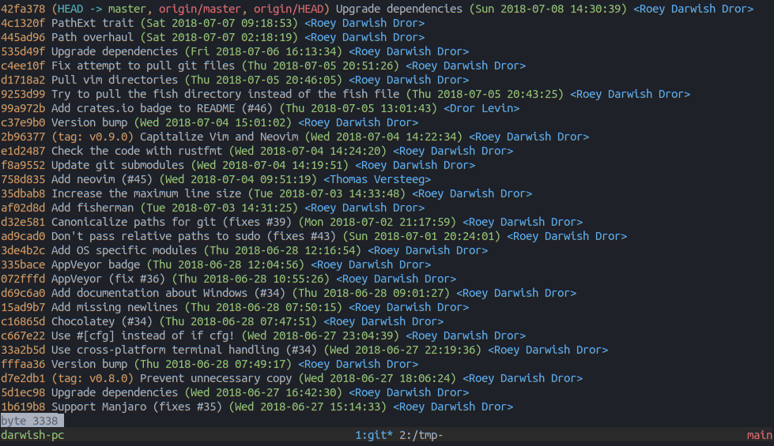

# Table of Contents #

* [About](#about)
* [Usage](#usage)
  * [Git](#git)
  * [Tmux](#tmux)

# About #

A collection of configuration file for git, tmux and others, as well as various plugins/packages as
git submodules.

See also my [emacs](https://github.com/drrlvn/.emacs.d), [vim](https://github.com/drrlvn/.vim) and
[fish](https://github.com/drrlvn/fish) configs.

I mostly assembled bits and pieces over time as the need grew, but some sources served as
inspiration and deserve explicit credit:

# Usage #

Install scripts are provided for some configurations that are a bit harder to setup. They are
deliberately kept separated so that users can pick and choose and are not forced to use everything.

Install script always get an optional path to where this repository is cloned and default to
`~/config-files`.

You can either clone using:

    git clone --recursive git://github.com/drrlvn/config-files.git

Or clone as usual and then run:

    git submodule update --init --recursive

## Git ##

Run the script `install-git.sh <REPO_PATH>`.

## Tmux ##

Run the script `tmux/install.sh <REPO_PATH>`.
